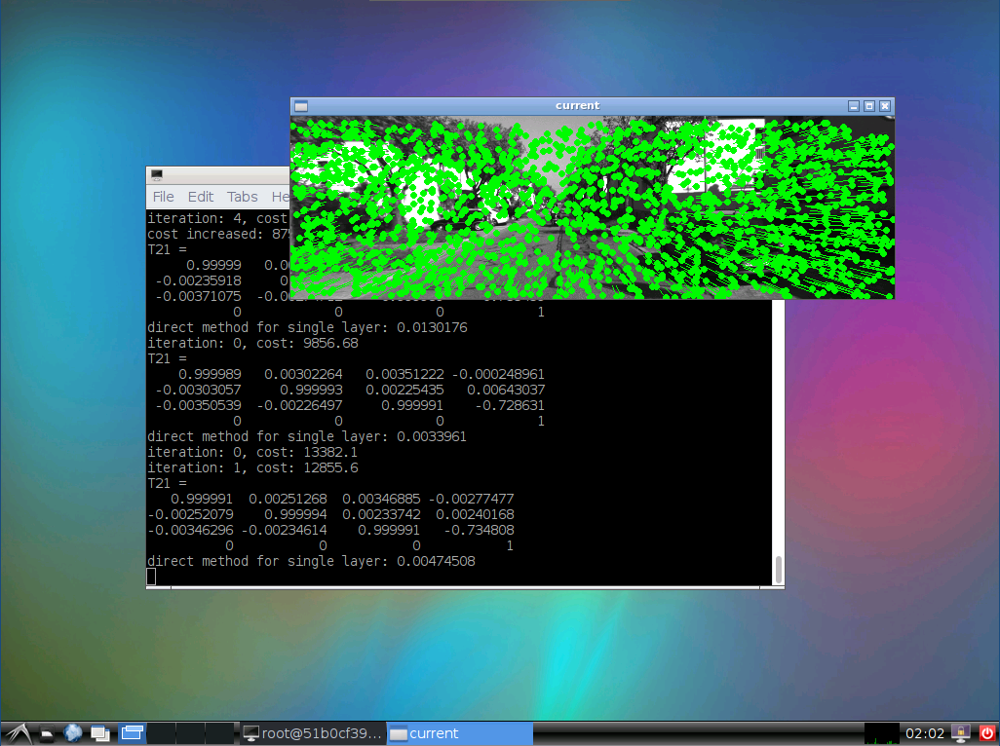
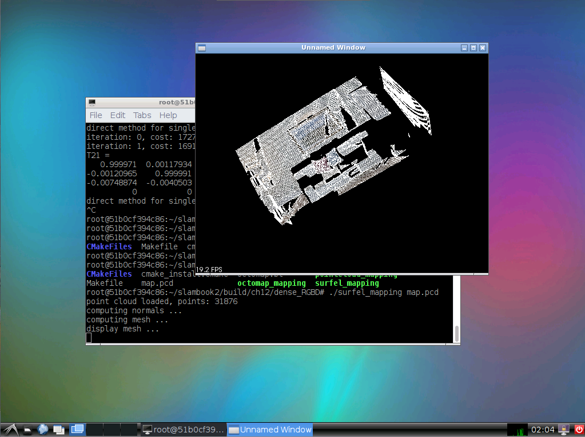

# Slambook2 in Docker
It's a Docker image for slambook2 codes from Dr.Gao Xiang, also can be built on a host machine!
In order to avoid the version problem from different libraries (e.g. Sophus, ceres, opencv etc) depended by slambook2 codes on different operating systems, the Docker image can form a virtual environment to run the codes. You can test the slambook2 codes in Docker, also build it on you own system (although only tested successfully on Ubuntu 16.04, it should work on other linux OSs).
## Build and Usage
### With Docker
build the Docker image in the repo root, like
```
docker build -t <your_image_name>:<tag> .
```
and "<>" can be replaced with "slambook2_docker:v1" as an example. The size of docker image may reach to about 8 GB.  
PS:Attention and not to ignore the end "."
After finishing building, you can start a container using
```
docker run -d -p 5900:5900 -v /dev/shm:/dev/shm <your_image_name>:<tag>
```
It will start a container which runs on the Ubuntu 16.04 with LXDE desktop environment, you can connect it with VNC Viewer to obtain the display of the system (Many codes in slambook2 need window display). Also, the Docker image is built on fcwu/docker-ubuntu-vnc-desktop with more details [here](https://github.com/fcwu/docker-ubuntu-vnc-desktop).
After then, you need to change your path to /root/slambook2 and compile the slambook2 codes with
```
mkdir build
cd build
cmake ..
make
```
This will generate all executable files in slambook2, you can check and test them according to the book.
### Without Docker
If you would like to build it on your own Ubuntu, the first is to make sure that your gcc/g++ version >=5.4.0 and cmake version >=3.17.5.Also, the idendity is recommended.Otherwise, you can check the Dockerfile and install.sh for more details about the installation of gcc/g++ and cmake. Also it needs to install some pre-libraries with
```
apt-get install -y libssl-dev libsuitesparse-dev qtdeclarative5-dev libqglviewer-dev  qt5-qmake libx11-dev libxmu-dev libglu1-mesa-dev libgl2ps-dev libxi-dev g++ libzip-dev libpng12-dev libcurl4-gnutls-dev libfontconfig1-dev libsqlite3-dev libglew*-dev libssl-dev libpcl-dev freeglut3 freeglut3-dev python-dev python3-dev libgtk2.0-dev pkg-config pcl-tools octovis
```
then build the 3rdparty libs at slambook2/3rdparty one by one. You are also allowed to use install.sh but make sure it contains commands of cmake installation, you need to modify it if your cmake is installed. Later, you can compile the slambook2 codes as above mentioned. Thanks a lot again for the slambook2 and Dr.Gao Xiang!
## Running pics


